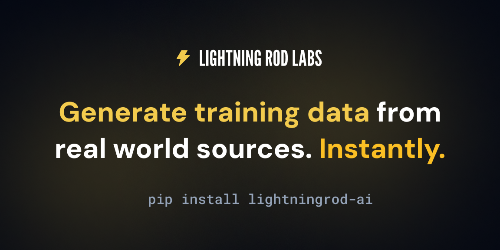

<div align="center">
  
</div>

# Lightning Rod Python SDK

The Lightning Rod SDK provides a simple Python API for generating custom forecasting datasets to train your LLMs. Transform news articles, documents, and other real-world data into high-quality training samples automatically.

## ✨ Quick Start

### 1. Install the SDK

```bash
pip install lightningrod-ai
```

### 2. Get your API key

Sign up at [lightningrod.ai](https://lightningrod.ai) to get your API key.

### 3. Generate your first dataset

```python
from datetime import datetime, timedelta
import pandas as pd
from lightningrod import (
    LightningRod,
    NewsSeedGenerator,
    ForwardLookingQuestionGenerator,
    WebSearchLabeler,
    QuestionPipeline,
    AnswerType,
    AnswerTypeEnum,
)

lr = LightningRod(api_key="your-api-key")

seed_generator = NewsSeedGenerator(
    start_date=datetime.now() - timedelta(days=90),
    end_date=datetime.now(),
    search_query="Trump",
    interval_duration_days=7
)

answer_type = AnswerType(answer_type=AnswerTypeEnum.BINARY)

question_generator = ForwardLookingQuestionGenerator(
    instructions="""
Generate binary forecasting questions about Trump's actions, decisions, and statements.

Focus: executive orders, cabinet appointments, legal proceedings, tariffs, immigration, tech policy.

Criteria: binary outcome, exact dates, self-contained, verifiable via web search, newsworthy, non-obvious.
""",
    examples=[
        "Will Trump impose 25% tariffs on all goods from Canada by February 1, 2025?",
        "Will Trump issue pardons to January 6 defendants within his first week in office?",
        "Will Pete Hegseth be confirmed as Secretary of Defense by February 15, 2025?",
        "Will Trump sign an executive order to keep TikTok operational in the US by January 31, 2025?",
        "Will Kash Patel be confirmed as FBI Director by March 1, 2025?",
    ],
    bad_examples=[
        "Will Trump do something controversial? (too vague)",
        "Will Trump be in the news? (obvious)",
        "Will tariffs be imposed? (needs specifics)",
    ]
)

pipeline = QuestionPipeline(
    seed_generator=seed_generator,
    question_generator=question_generator,
    labeler=WebSearchLabeler(answer_type=answer_type),
)

dataset = lr.transforms.run(pipeline, max_questions=10) # limit to 10 questions (rows) for testing
df = pd.DataFrame(dataset.flattened())
df.head()
```

This pipeline will:

1. **Collect Seeds**: Search for recent news about Premier League Soccer
2. **Generate Questions**: Use AI to create forecasting questions from the news
3. **Label Questions**: Automatically find answers using web search
4. **Return Dataset**: Get a dataset with all samples ready for download

## 🎥 Examples

Comprehensive example notebooks demonstrate different use cases and features:

### Getting Started
- **[Quick Start](examples/01_quick_start.ipynb)** — Simplest example + docs to get you running quickly

### Data Sources
- **[Google News](examples/02_google_news_datasource.ipynb)** — Use Google News search as a data source
- **[GDELT](examples/03_gdelt_datasource.ipynb)** — Use GDELT global news database for large-scale datasets
- **[Custom Documents](examples/04_custom_documents_datasource.ipynb)** — Generate questions from your own documents and files

### Question Types
- **[Binary](examples/05_binary_answer_type.ipynb)** — Yes/No questions for event prediction
- **[Continuous](examples/06_continuous_answer_type.ipynb)** — Numeric questions for quantitative predictions
- **[Multiple Choice](examples/07_multiple_choice_answer_type.ipynb)** — Questions with predefined answer options
- **[Free Response](examples/08_free_response_answer_type.ipynb)** — Open-ended questions with detailed text answers

## 📁 Documentation

**[Quick Start](examples/01_quick_start.ipynb)**  example also serves as interactive documentation - we recommend starting there!

For complete API reference documentation, see [API.md](API.md). This includes overview of the core system concepts, methods and types.

## License

MIT License - see LICENSE file for details
