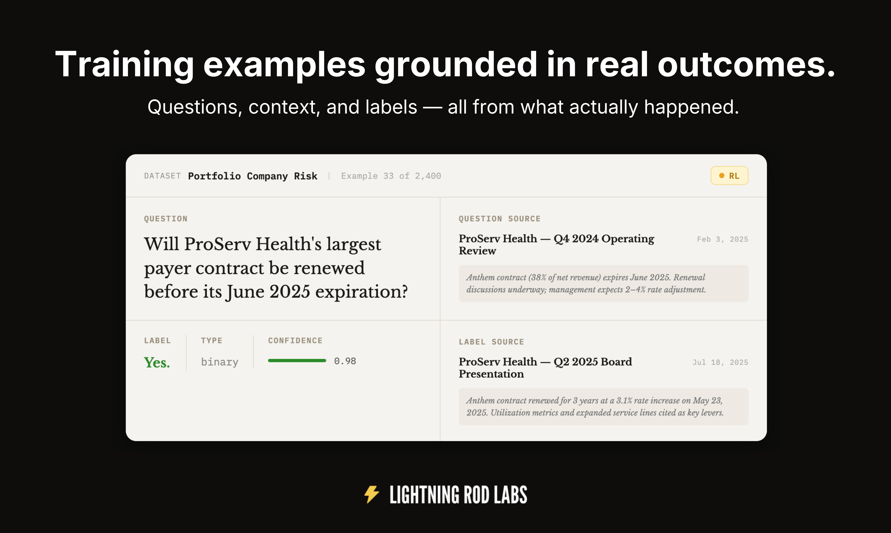

Dataset generation turns raw data into labeled forecasting samples through a configurable pipeline. You define the sources, question style, and labeling approach; the SDK handles the rest.

## Pipeline Stages

A typical pipeline runs through these stages:

1. **Seed generation** — Fetch raw data (news articles, documents, etc.)
2. **Question generation** — Create forecasting questions from seeds using AI
3. **Deduplication** (optional) — Remove near-duplicate questions via exact or fuzzy matching
4. **Context** (optional) — Enrich samples with relevant news or RAG-retrieved documents
5. **Labeling** — Resolve questions with ground truth via web search
6. **Rendering** — Format questions into prompts for model input
7. **Rollouts** (optional) — Send prompts to one or more LLMs
8. **Scoring** (optional) — Score model outputs (from rollouts) against ground truth

## QuestionPipeline

`QuestionPipeline` orchestrates these stages. You configure each stage and pass the config to `lr.transforms.run()`:

```python
import lightningrod as lr

client = lr.LightningRod(api_key="your-api-key")
binary_answer = lr.BinaryAnswerType()

# Get AI news to train a domain expert
seeds = lr.NewsSeedGenerator(
    start_date="2025-01-01",
    end_date="2025-04-01",
    search_query=["frontier AI model", "AI agents", "open source LLM", "AI research"],
)

# Define the scope and style of the questions
questioner = lr.ForwardLookingQuestionGenerator(
    instructions="Write forward-looking, self-contained questions with explicit dates/entities.",
    examples=["Will OpenAI publicly release GPT-5 by March 15, 2026?"],
    answer_type=binary_answer,
)

# Verify answers against live sources
labeler = lr.WebSearchLabeler(answer_type=binary_answer)

# Run pipeline
pipeline = lr.QuestionPipeline(seed_generator=seeds, question_generator=questioner, labeler=labeler)
dataset = client.transforms.run(pipeline, max_questions=1000)
```

## Running the Pipeline

- **`lr.transforms.run(config, input_dataset=None, max_questions=None, max_cost_dollars=None, name=None, detach=False)`** — Submit and wait for completion. Returns a `Dataset`.
- **`lr.transforms.submit(config, input_dataset=None, max_questions=None, max_cost_dollars=None, name=None)`** — Submit without waiting. Returns a `TransformJob`.
- **`lr.transforms.estimate_cost(config, max_questions=None)`** — Estimate cost in dollars before running.

Use `detach=True` for long-running jobs so the job continues even if your local process exits.

## Next Steps

- [Core Concepts](core-concepts.md) — Sample, Pipeline, Dataset, Transform Job
- [Seed Generators](seed-generators.md) — News, GDELT, FileSet, FileSetQuery
- [Question Generators](question-generators.md) — Question, ForwardLooking, QuestionAndLabel, Template
- [Deduplication](deduplication.md) — KeyDeduplication, fuzzy and exact field matching
- [Labeling and Context](labeling-and-context.md) — WebSearchLabeler, NewsContextGenerator
- [Rollouts & Scoring](rollouts-and-scoring.md) — QuestionRenderer, RolloutGenerator, RolloutScorer, model consensus analysis
- [Answer Types](answer-types.md) — Binary, Continuous, MultipleChoice, FreeResponse
- [Datasets](datasets.md) — Creating, fetching, and using datasets
- [Examples](examples.md) — Notebooks and tutorials
