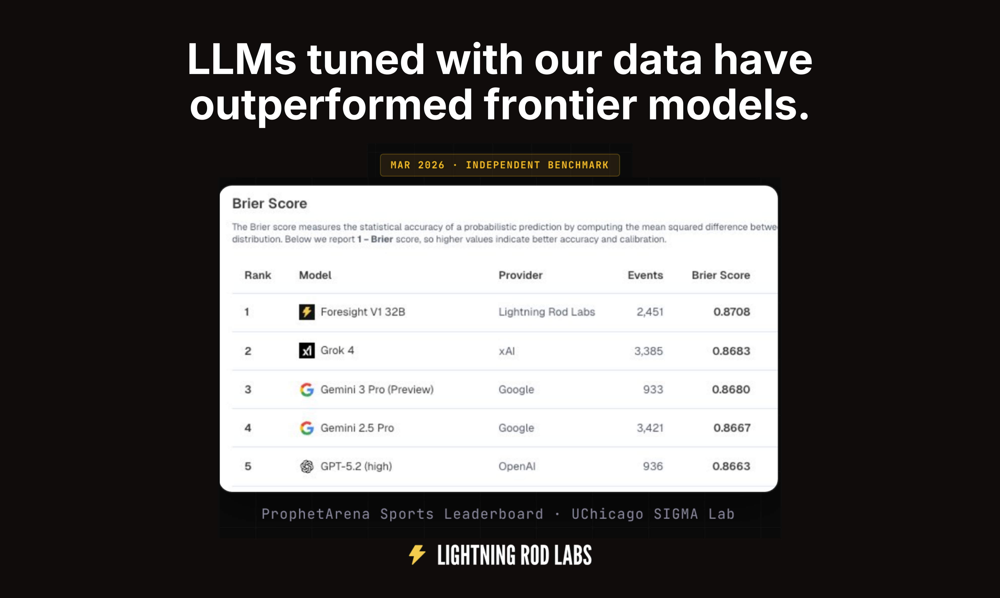

# Forecasting

Get probability estimates on binary forecasting questions with Lightning Rod's hosted models. No training required—call the API and receive calibrated forecasts.

## Foresight-v3

**foresight-v3** is Lightning Rod's latest forecasting model. Pass any binary forecasting question and receive a probability estimate between 0 and 1. Use it via the OpenAI-compatible API.

### Setup

Sign up at [dashboard.lightningrod.ai](https://dashboard.lightningrod.ai/sign-up?redirect=/api) to get your API key and **$50 of free credits**.

```bash
pip install openai lightningrod-ai
```

```python
from openai import OpenAI

client = OpenAI(
    api_key="lightningrod-api-key", 
    base_url="https://api.lightningrod.ai/api/public/v1/openai"
)
```

### Get forecasts

Pass any forecasting question to foresight-v3.

```python
questions = [
    "Will the Fed cut rates by 25bp in March 2026?",
    "Will Apple announce a new Vision Pro model in 2026?",
    "Will the S&P 500 close above 6000 by end of 2026?",
]

for q in questions:
    response = client.chat.completions.create(
        model="LightningRodLabs/foresight-v3",
        messages=[
            {"role": "system", "content": "Answer as a probability between 0 and 1."},
            {"role": "user", "content": q}
        ]
    )
    print(f"Q: {q}")
    print(f"A: {response.choices[0].message.content}\n")
```

### Lightning Rod parameters

In addition to the standard OpenAI fields (`temperature`, `max_tokens`, `top_p`, …), the endpoint accepts three Lightning Rod-specific parameters. With the OpenAI client they are passed via `extra_body`, since they are not part of the standard schema.

| Parameter | Values | Description |
|-----------|--------|-------------|
| `reasoning_effort` | `"low"`, `"medium"` (default), `"high"` | How much the model reasons before answering. Higher effort spends more tokens for better-calibrated forecasts. |
| `answer_type` | `"binary"`, `"multiple_choice"`, `"continuous"`, `"free_response"`, `"auto"` | Injects output-format guidance and appends a structured answer between `<answer></answer>` tags. `"auto"` classifies the question server-side first. Omit for prose only. |
| `research` | `true`, or `{"sources": [...]}` | Opt-in web research before forecasting. `true` queries all sources (`perplexity`, `news`, `google_search`); pass an object to choose. Each source is billed as a separate research event. Omit or `false` to disable. |

```python
response = client.chat.completions.create(
    model="LightningRodLabs/foresight-v3",
    messages=[{"role": "user", "content": "Will the Fed cut rates by 25bp in March 2026?"}],
    extra_body={
        "reasoning_effort": "high",
        "answer_type": "binary",
        "research": {"sources": ["perplexity", "news"]},
    },
)
```

### Response fields

Beyond the standard `choices[0].message.content`, responses may include:

- **`message.content`** — the full response. When `answer_type` is set, the structured answer is embedded between `<answer></answer>` tags at the end (a single float for `binary`, JSON `{"mean", "standard_deviation"}` for `continuous`, an `<options>` map plus an `<answer>` probability map for `multiple_choice`, plain text for `free_response`).
- **`message.thinking`** — the reasoning chain (present for foresight models; may be `null` for others).
- **`message.annotations`** — `url_citation` entries, present only when research ran.
- **`usage`** — always carries token counts plus `cost_usd` and `inference_cost_usd`; `research_cost_usd` appears when research ran and `classification_cost_usd` when `answer_type="auto"`.

### API reference

See the [API docs](https://docs.lightningrod.ai/rest-api#post-openai-chat-completions) for full details on parameters (temperature, max_tokens, etc.).

## Try it

Run the [foresight-v3 notebook](https://colab.research.google.com/github/lightning-rod-labs/lightningrod-python-sdk/blob/main/notebooks/evaluation/01_foresight_model.ipynb) in Google Colab for a complete walkthrough.
