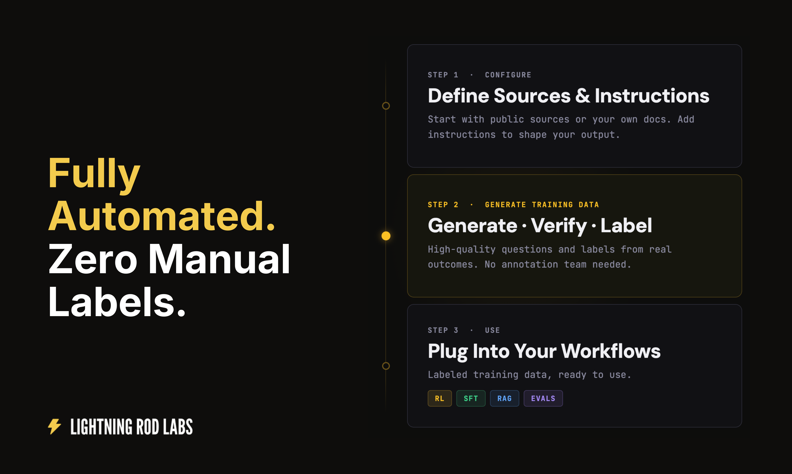

The Lightning Rod SDK provides a simple, but powerful end-to-end API for generating custom synthetic datasets and fine-tuning LLMs. 

Transform news articles, documents, and other real-world data into high-quality training samples automatically.

## How It Works

The SDK follows a pipeline-based workflow:

1. **Seeds** — Raw data from news articles, documents, or custom sources
2. **Questions** — AI-generated forecasting questions from seeds
3. **Context** — Optional enrichment with relevant news or RAG-retrieved documents
4. **Labels** — Ground truth answers resolved via web search
5. **Dataset** — Training-ready samples in a format you can use immediately
6. **Train** — Fine-tune models on your datasets _(early access)_
7. **Eval** — Run evals against the test dataset _(early access)_
8. **Inference** — Run predictions with your fine-tuned model _(early access)_

You configure a pipeline, run it, and receive a labeled dataset. No manual question writing or labeling required. With early access, you can also train, evaluate, and run inference with models end-to-end.

## Research Foundation

Lightning Rod is based on our research: [Future-as-Label: Scalable Supervision from Real-World Outcomes](https://arxiv.org/abs/2601.06336). We use this approach to generate the [Future-as-Label training dataset](https://huggingface.co/datasets/LightningRodLabs/future-as-label-paper-training-dataset) for our paper.

## What's Next

* [Quickstart](quickstart.md) — Install the SDK and generate your first dataset in minutes
* [Examples](examples.md) — Run tutorials and end-to-end notebooks in Google Colab
* [Dataset Generation](dataset-generation/overview.md) — Deep dive into pipelines, seed generators, and question types
* [Forecasting](forecasting/overview.md) — Get probability estimates with foresight-v3 forecasting model
* [Fine Tuning](fine-tuning/overview.md) — Fine-tune models on your generated datasets (early access)
